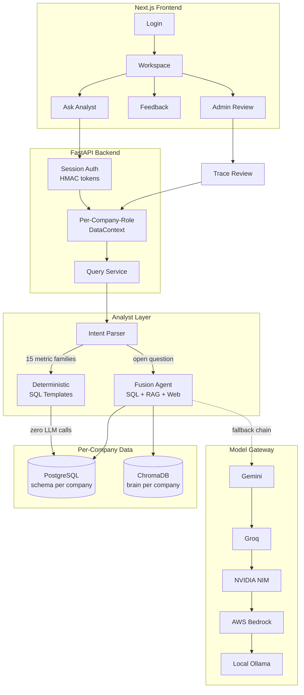
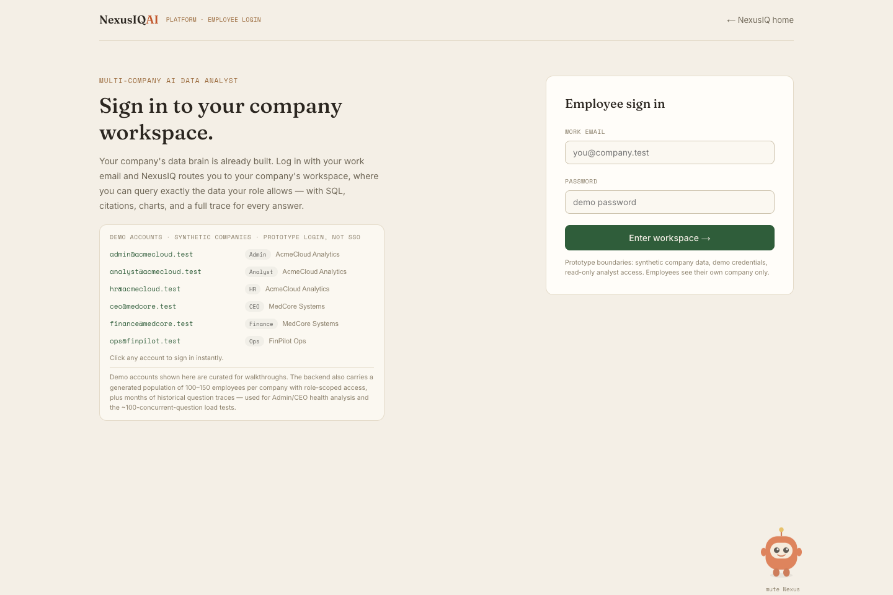
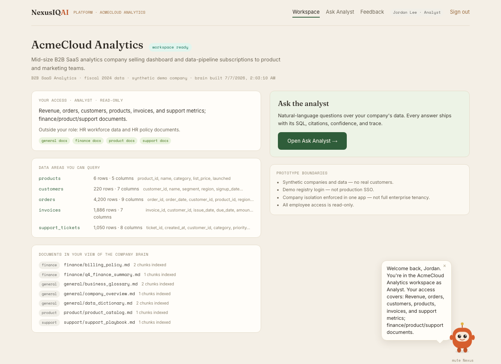
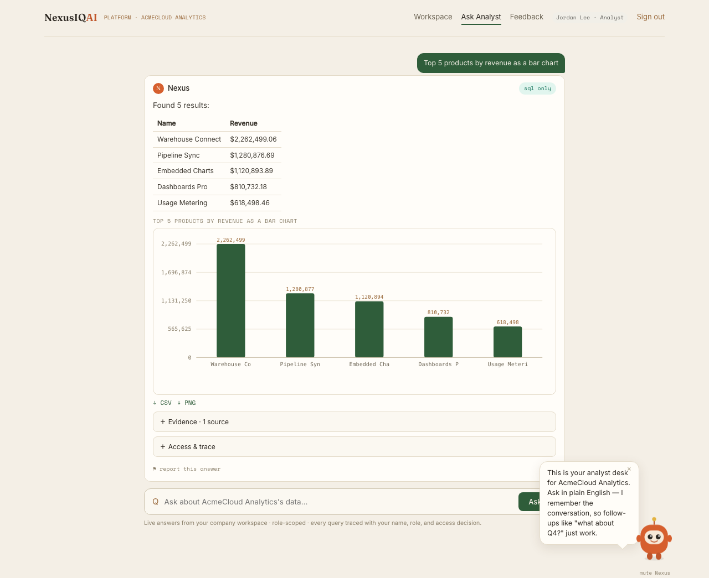
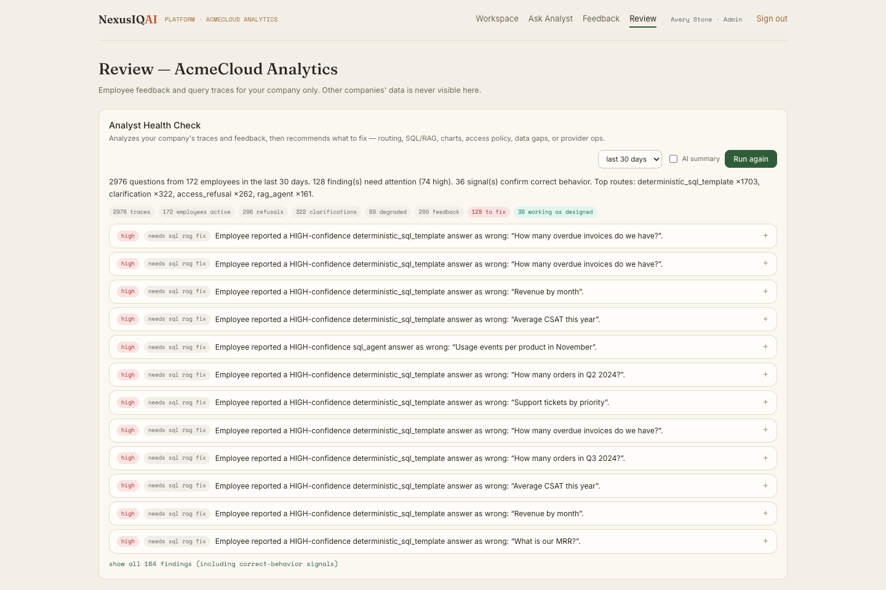
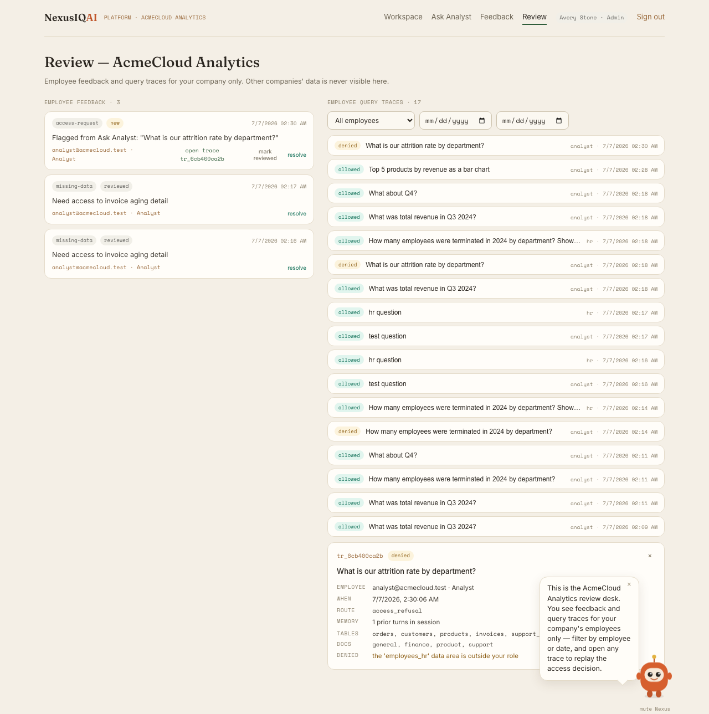
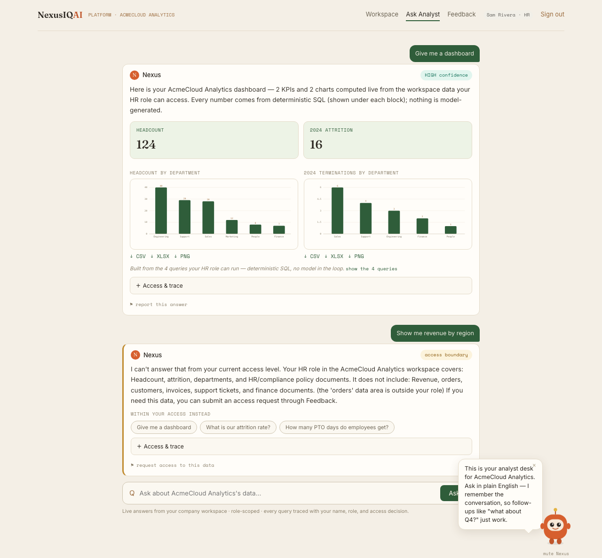

<div align="center">

# NexusIQ AI Platform

### A governed AI data analyst for company workspaces

*Employees ask business questions in plain English. NexusIQ routes the question through role-scoped SQL, documents, and deterministic templates — and every answer carries its SQL, citations, chart, access decision, and a reviewable trace.*

[](https://github.com/premsai-pendela/NexusIQAI-Platform/actions/workflows/ci.yml)
[](https://python.org)
[](https://nextjs.org)
[](https://fastapi.tiangolo.com)
[](https://langchain-ai.github.io/langgraph/)
[](https://aws.amazon.com/rds/)
[](https://aws.amazon.com)
[](LICENSE)

**[🚀 Live Demo](https://nexusiq-ai.com/platform)** — demo accounts listed on the login page

[What It Is](#what-it-is) · [Architecture](#architecture) · [Access Control](#role-based-access-four-layers-deep) · [Deterministic Layer](#deterministic-analyst-layer-zero-llm-calls) · [Screenshots](#screenshots) · [Tech Stack](#tech-stack) · [Run Locally](#run-locally) · [Testing](#testing--verification) · [Limitations](#honest-limitations) · [Roadmap](docs/FUTURE_IMPROVEMENTS.md)

</div>

---

## What It Is

Most "chat with your data" demos are a single tenant, a single corpus, and an LLM that answers everything — including things it shouldn't. NexusIQAI is built the other way around:

> Each company gets its own SQL schema and document "brain." Each employee's role determines exactly what tables and document departments they can touch — enforced structurally, not by a prompt instruction. Common business questions never touch an LLM at all. Every answer, allowed or refused, leaves a trace an Admin/CEO can audit.

This isn't a hypothetical enterprise pitch — it's a working prototype with real access-control tests, a 347-test suite, and live-verified LLM smoke scenarios across three synthetic companies.

## Architecture



## Role-Based Access, Four Layers Deep

A request can never widen what it's allowed to see — because the boundary lives in the agent instance, not a per-request filter:

| Layer | Enforcement |
|---|---|
| **SQL prompt** | The generation prompt only describes the role's allowed tables |
| **SQL AST** | `sqlglot` parses generated SQL and rejects any query touching a table outside the allowlist |
| **RAG retrieval** | ChromaDB department filter applied on vector, hybrid, and BM25 search paths |
| **Response filter** | Citations and traces are re-checked against the access policy before leaving the API |

A trace-leakage auditor (`scripts/inspect_platform_traces.py`) runs across every saved trace and proves zero cross-role or cross-company reads.

## Deterministic Analyst Layer (Zero LLM Calls)

15 business-metric families — revenue, orders, invoices, support tickets, HR headcount — answer from **role-checked template SQL with no model call at all**:

- Follow-ups resolve from stored session intent: *"what about Q4?"*, *"compare that with Q3"*, *"show that as a bar chart"* — each re-authorized against the current role, so memory can never escalate access.
- The product stays fully functional when every LLM provider is rate-limited — traces record `llm_skipped: true` so the distinction is auditable, not just claimed.
- Verified under a 100-concurrent-question load test with **zero LLM calls end to end**.

## Screenshots

| Login (honest demo-registry label) | Workspace (role-scoped access card) |
|---|---|
|  |  |

| Ask Analyst — chart answer | Admin — Health Check Agent |
|---|---|
|  |  |

| Trace detail (Admin audit view) | Refusal at the access boundary |
|---|---|
|  |  |

## Admin Health Check Agent

An Admin/CEO-only, manually-triggered agent — not a background cron — that audits every trace since the last run:

1. Admin clicks **Run** in the Review page.
2. The agent walks every saved trace for the company and checks whether the question and answer actually matched — flagging wrong, vague, or misrouted answers.
3. Findings are reported on a dashboard, each with a suggested fix pointing at *where the analyst logic needs to change*.
4. A human (CEO or a verification-authorized employee) reviews and approves a finding before an engineer implements the fix — agent self-improvement is human-gated, not automatic.

## Tech Stack

**Backend**: Python, FastAPI, LangGraph, SQLAlchemy, `sqlglot` (AST validation), ChromaDB + sentence-transformers, BM25 hybrid retrieval, cross-encoder reranking
**Frontend**: TypeScript, Next.js 16 (App Router, SSR), React 19
**Data**: PostgreSQL (AWS RDS, schema-per-company), per-company ChromaDB brains
**Model gateway**: Gemini, Groq, NVIDIA NIM (streaming client), AWS Bedrock, local Ollama — quota-aware routing with per-model cooldowns and fallback chains
**Cloud**: AWS (ECS Fargate, Application Load Balancer with ACM-issued HTTPS, RDS, Secrets Manager, CloudWatch, ECR), AWS Amplify (frontend hosting)
**Testing**: pytest (347+ tests: AST denial, RAG boundary, memory isolation, deterministic families with the LLM path deliberately disabled), headless browser QA

## Run Locally

```bash
# backend
source .venv/bin/activate
uvicorn api.main:app --port 8000

# frontend
cd web && npm run build && npx next start -p 3000
# open http://localhost:3000/platform — demo accounts listed on the login page
```

First run after a fresh clone: `python -m nexus_platform.brain_builder` builds the company brains (Chroma + catalogs) — they're runtime artifacts, not committed.

## Testing & Verification

```bash
python -m pytest tests/ -q                       # 347+ tests
python scripts/platform_smoke.py                  # live LLM scenarios across 3 companies
python scripts/check_access.py --matrix           # role/table access policy dry-run
python scripts/inspect_platform_traces.py         # trace-leakage audit
python scripts/load_test.py --n 100               # 100-concurrent, zero-LLM-call load test
cd web && npm run lint && npm run build
```

## Honest Limitations

- Demo employee registry with hashed demo passwords — **not** production SSO.
- Synthetic companies and data only — no real customers, revenue, or people.
- Company isolation is enforced inside one application process — a real per-tenant deployment model is future work, not what's running today.
- The keyword-based intent gate exists for UX speed; security depends on the AST and retrieval filters, not the keyword check.
- See [`docs/FUTURE_IMPROVEMENTS.md`](docs/FUTURE_IMPROVEMENTS.md) for what's next, including a knowledge-graph/GraphRAG layer.

## License

MIT — see [LICENSE](LICENSE).
