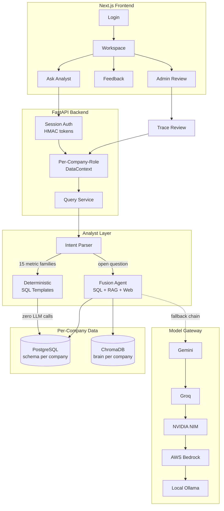
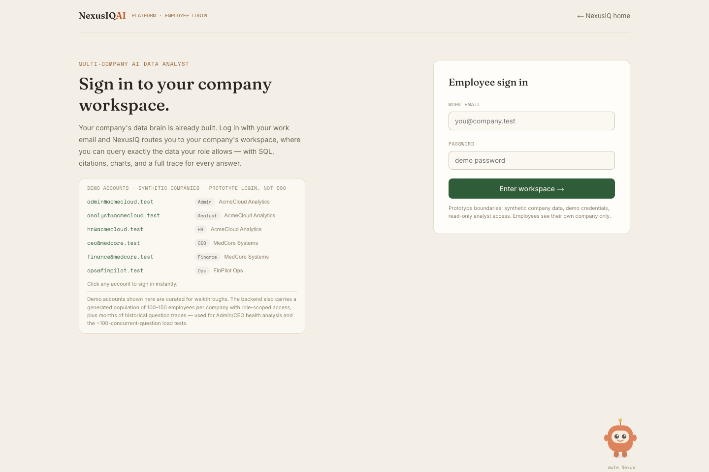
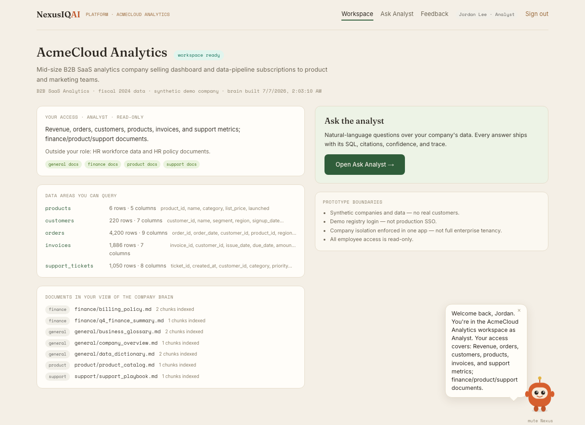
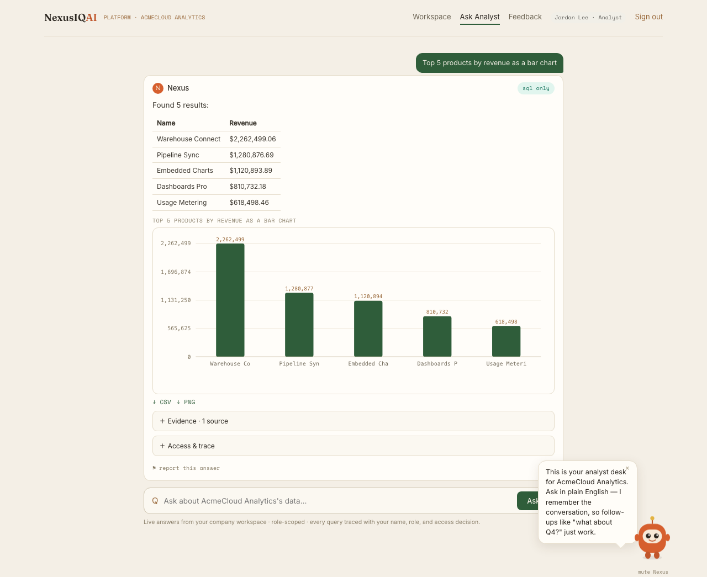
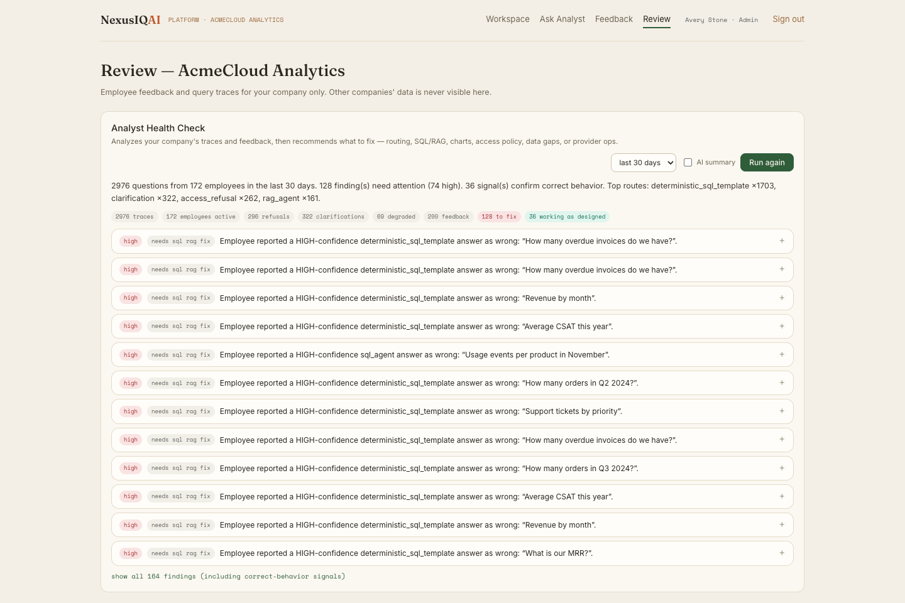
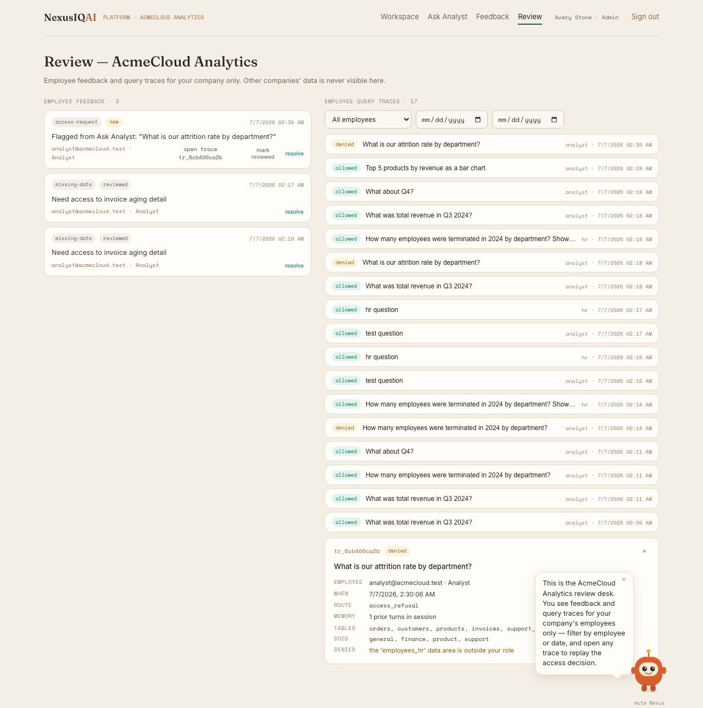
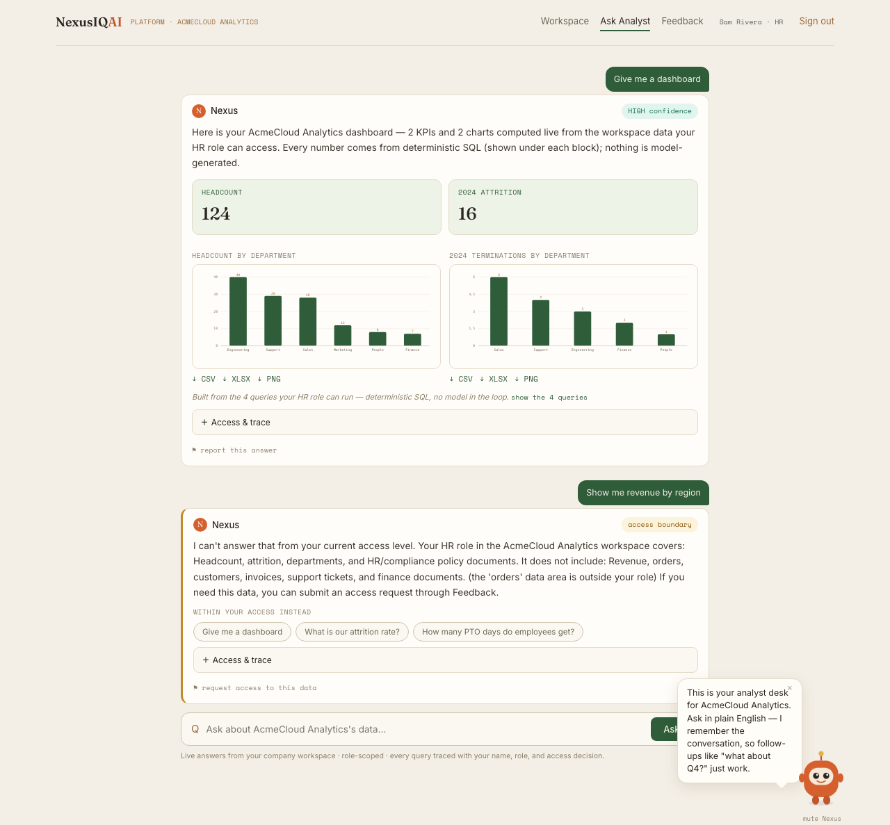

<div align="center">

# NexusIQ AI Platform

### A governed AI data analyst for company workspaces

*Employees ask business questions in plain English. NexusIQ routes the question through role-scoped SQL, documents, and deterministic templates — and every answer carries its SQL, citations, chart, access decision, and a reviewable trace.*

[](https://github.com/premsai-pendela/NexusIQAI-Platform/actions/workflows/ci.yml)
[](https://python.org)
[](https://nextjs.org)
[](https://fastapi.tiangolo.com)
[](https://langchain-ai.github.io/langgraph/)
[](https://aws.amazon.com/rds/)
[](https://aws.amazon.com)
[](LICENSE)

**🚀 Live Demo — temporarily offline.** The hosted environment is paused; the frontend at [nexusiq-ai.com/platform](https://nexusiq-ai.com/platform) still loads but the API is not serving. Everything below runs locally from this repo — see [Run Locally](#run-locally).

[What It Is](#what-it-is) · [Architecture](#architecture) · [Access Control](#role-based-access-four-layers-deep) · [Deterministic Layer](#deterministic-analyst-layer-zero-llm-calls) · [Screenshots](#screenshots) · [Health Check Agent](#the-second-agent-health-check--repair--pull-request) · [Tech Stack](#tech-stack) · [Run Locally](#run-locally) · [Testing](#testing--verification) · [Limitations](#honest-limitations) · [Roadmap](ROADMAP.md)

</div>

---

## What It Is

Most "chat with your data" demos are a single tenant, a single corpus, and an LLM that answers everything — including things it shouldn't. NexusIQAI is built the other way around:

> Each company gets its own SQL schema and document "brain." Each employee's role determines exactly what tables and document departments they can touch — enforced structurally, not by a prompt instruction. Common business questions never touch an LLM at all. Every answer, allowed or refused, leaves a trace an Admin/CEO can audit.

And a **second agent audits the first**: it grades the analyst's own traces, and when it finds a real defect it writes a regression test, writes the fix, and opens a pull request for a human to review — it structurally cannot merge. Two such fixes are merged in this repo's history. See [Health Check Agent](#the-second-agent-health-check--repair--pull-request).

This isn't a hypothetical enterprise pitch — it's a working prototype with real access-control tests, a 479-test suite, and live-verified LLM smoke scenarios across three synthetic companies.

## Architecture


```mermaid
flowchart TB
    subgraph Frontend["Next.js Frontend"]
        Login[Login] --> Workspace[Workspace]
        Workspace --> Ask[Ask Analyst]
        Workspace --> Feedback[Feedback]
        Workspace --> Admin[Admin Review]
    end

    subgraph API["FastAPI Backend"]
        Auth[Session Auth<br/>HMAC tokens]
        Context[Per-Company-Role<br/>DataContext]
        Query[Query Service]
    end

    subgraph Analyst["Analyst Layer"]
        Intent[Intent Parser]
        Det[Deterministic<br/>SQL Templates]
        Fusion[Fusion Agent<br/>SQL + RAG + Web]
    end

    subgraph Data["Per-Company Data"]
        SQL[(PostgreSQL<br/>schema per company)]
        Chroma[(ChromaDB<br/>brain per company)]
    end

    subgraph Gateway["Model Gateway"]
        Gemini[Gemini]
        Groq[Groq]
        NVIDIA[NVIDIA NIM]
        Bedrock[AWS Bedrock]
        Ollama[Local Ollama]
    end

    Ask --> Auth --> Context --> Query
    Query --> Intent
    Intent -->|"15 metric families"| Det
    Intent -->|"open question"| Fusion
    Det -->|zero LLM calls| SQL
    Fusion --> SQL
    Fusion --> Chroma
    Fusion -.fallback chain.-> Gemini --> Groq --> NVIDIA --> Bedrock --> Ollama

    Admin --> Traces[Trace Review]
    Traces --> Context
```

## Role-Based Access, Four Layers Deep

A request can never widen what it's allowed to see — because the boundary lives in the agent instance, not a per-request filter:

| Layer | Enforcement |
|---|---|
| **SQL prompt** | The generation prompt only describes the role's allowed tables |
| **SQL AST** | `sqlglot` parses generated SQL and rejects any query touching a table outside the allowlist |
| **RAG retrieval** | ChromaDB department filter applied on vector, hybrid, and BM25 search paths |
| **Response filter** | Citations and traces are re-checked against the access policy before leaving the API |

A trace-leakage auditor (`scripts/inspect_platform_traces.py`) runs across every saved trace and proves zero cross-role or cross-company reads.

## Deterministic Analyst Layer (Zero LLM Calls)

15 business-metric families — revenue, orders, invoices, support tickets, HR headcount — answer from **role-checked template SQL with no model call at all**:

- Follow-ups resolve from stored session intent: *"what about Q4?"*, *"compare that with Q3"*, *"show that as a bar chart"* — each re-authorized against the current role, so memory can never escalate access.
- The product stays fully functional when every LLM provider is rate-limited — traces record `llm_skipped: true` so the distinction is auditable, not just claimed.
- Verified under a 100-concurrent-question load test with **zero LLM calls end to end**.

## Screenshots

| Login (honest demo-registry label) | Workspace (role-scoped access card) |
|---|---|
|  |  |

| Ask Analyst — chart answer | Admin — Health Check Agent |
|---|---|
|  |  |

| Trace detail (Admin audit view) | Refusal at the access boundary |
|---|---|
|  |  |

## The Second Agent: Health Check → Repair → Pull Request

The analyst answers questions. A **second agent audits the analyst** — and, when it finds a real defect, fixes it and opens a pull request a human reviews.

### 1. Traffic — simulated employees (`sim_employees/`)

A demo has no real employees, so this repo ships a **traffic generator that lives outside the product**: role-scoped personas that read the company brain and deliberately attack the analyst — malformed questions, typo'd metrics, multi-table joins, boundary probes, and follow-ups designed to break session memory. Each persona keeps its own file memory so it doesn't repeat a solved question, and a paced runner keeps it from draining the free-tier quota. Every resulting trace is tagged `source="simulated"` and is never conflated with real usage in any report or admin view.

In production this step is just *real employees asking real questions* — the simulator only stands in for them here.

### 2. Audit — the Health Check agent (`nexus_platform/health_review.py`)

Admin/CEO-only and **manually triggered — not a background cron**. It walks every trace since the last run's watermark and grades each one on a 3-tier escalation:

| Tier | How it grades |
|---|---|
| **Deterministic** (free, exact) | Recomputes ground truth from the company's own data (numeric oracle) or re-derives the role policy, then compares against what the analyst actually did |
| **LLM judge** (capped) | For fuzzy traces the oracle can't grade (RAG/narrative answers, clarifications) — with a hard per-run call budget so it never drains quota |
| **Human review** | Anything neither tier can judge confidently is flagged, not guessed |

Output is a report of findings — wrong, vague, misrouted, or falsely refused answers — each pointing at a likely cause. Findings it can't stand behind are dismissed loudly rather than padded.

### 3. Repair — the pipeline that writes the code (`nexus_platform/repair/`)

Pointed at a finding, the pipeline runs a staged loop: **localize → understand → hypothesize → critique → plan → confirm_plan → implement → test → eval gate**. It creates a git worktree, writes a regression test that reproduces the bug, writes the fix, and runs the gate:

> the repro must fail before the change and pass after, with **zero new failures** against the baseline suite.

Only a gate-passing fix is committed. Then `repair/pr.py` opens a pull request under a separate bot identity (`Nexus-Healthcheck-Bot`) with the before/after evidence in the body.

**Model routing is per-sub-task** (`repair/cli_brain.py`). Weak free-tier models can't do complex program repair, so the hard reasoning stages run on **Claude Code invoked headlessly** (`claude -p`), while the cheap localization stage stays on the product's free-tier gateway. Two rules pick the tier automatically from a ladder:

1. **A reviewer is never weaker than the author it reviews** — review stages (`critique`, `confirm_plan`, `self_review`) always run on the top tier, because nothing downstream catches a rubber-stamp.
2. **Generation stages start at a complexity-appropriate tier and escalate** one tier per validator-rejected retry, so a stage is never silently stuck on a model too weak to pass its own check.

The CLI turn runs with **all tools disabled and a single turn** — the prompt carries every slice of code and trace context, and the model only emits text. It never reads or edits the repo itself.

### 4. The human gate — structural, not a promise

**The agent cannot merge.** There is no merge primitive, no push to master, and no merge API call anywhere in the repair or campaign code — and [`tests/platform_mode/test_repair_no_merge_path.py`](tests/platform_mode/test_repair_no_merge_path.py) fails the build if one ever appears. The only path to `master` is a human reviewing and merging a PR.

### Shipped by this loop

Two pipeline-authored fixes are merged in this repo's history — diagnosis, plan, regression test, and code all produced by the pipeline, reviewed and merged by a human:

| PR | Bug | Brain | Evidence |
|---|---|---|---|
| [#1](https://github.com/premsai-pendela/NexusIQAI-Platform/pull/1) | SQL agent invented an NPS formula for a metric the company doesn't track, answering `"Nps score: -1"` | Free-tier chain (Cerebras / Groq / Gemini / NVIDIA NIM) | ~10 attempts; one vacuous fix caught by behavioral validation |
| [#13](https://github.com/premsai-pendela/NexusIQAI-Platform/pull/13) | A garbled question made the SQL model hallucinate a nonexistent table; the API then fabricated a confident false role-denial for it | Claude Code via CLI | 5 LLM calls; repro failed before → passed after, zero new regressions |

The free-tier run is why the routing above exists: the same loop on a stronger reasoning tier produced a cleaner fix in a fraction of the calls.

### Honest limits of the loop

- It has produced **two** fixes — proof the loop closes end to end, not a claim of volume.
- **Intermittent (stochastic) defects stay open.** A fix must be provable by a test that fails before and passes after; a bug that only misbehaves on some runs can't be pinned that way yet, so those findings are logged open with their diagnosis instead of being faked past.
- Findings are reviewed by a human before anything reaches `master`. Nothing here is self-merging or unattended.

### Trace console

Every answer — real or simulated — is durable (RDS Postgres in cloud, SQLite locally) and auditable in an admin console with a Year › Month › Day drill-down, a real/simulated source filter, and the analyst's full answer plus access decision on each trace.

## Tech Stack

**Backend**: Python, FastAPI, LangGraph, SQLAlchemy, `sqlglot` (AST validation), ChromaDB + sentence-transformers, BM25 hybrid retrieval, cross-encoder reranking
**Frontend**: TypeScript, Next.js 16 (App Router, SSR), React 19
**Data**: PostgreSQL (AWS RDS, schema-per-company), per-company ChromaDB brains
**Model gateway**: Gemini, Groq, NVIDIA NIM (streaming client), AWS Bedrock, local Ollama — quota-aware routing with per-model cooldowns and fallback chains
**Cloud**: AWS (ECS Fargate, Application Load Balancer with ACM-issued HTTPS, RDS, Secrets Manager, CloudWatch, ECR), AWS Amplify (frontend hosting)
**Agent loop**: simulated-employee traffic generator, trace-auditing Health Check agent (deterministic oracle → capped LLM judge → human), eval-gated repair pipeline with headless Claude Code (`claude -p`) as its reasoning brain, GitHub PRs via a separate bot identity
**Testing**: pytest (479 tests: AST denial, RAG boundary, memory isolation, deterministic families with the LLM path deliberately disabled), headless browser QA

## Run Locally

```bash
# backend
source .venv/bin/activate
uvicorn api.main:app --port 8000

# frontend
cd web && npm run build && npx next start -p 3000
# open http://localhost:3000/platform — demo accounts listed on the login page
```

The demo-company brains (Chroma + catalogs) are committed, so a fresh clone runs as-is. After changing any source document or schema, rebuild with `python -m nexus_platform.brain_builder`; `python -m nexus_platform.brain_builder --check` is a fast staleness guard and runs in CI.

## Testing & Verification

```bash
python -m pytest tests/ -q                       # 479 tests
python scripts/platform_smoke.py                  # live LLM scenarios across 3 companies
python scripts/check_access.py --matrix           # role/table access policy dry-run
python scripts/inspect_platform_traces.py         # trace-leakage audit
python scripts/load_test.py --n 100               # 100-concurrent, zero-LLM-call load test
python scripts/run_repair.py --company acmecloud --list   # open Health Check findings
cd web && npm run lint && npm run build
```

## Honest Limitations

- Demo employee registry with hashed demo passwords — **not** production SSO.
- Synthetic companies and data only — no real customers, revenue, or people.
- Company isolation is enforced inside one application process — a real per-tenant deployment model is future work, not what's running today.
- The keyword-based intent gate exists for UX speed; security depends on the AST and retrieval filters, not the keyword check.
- See [`ROADMAP.md`](ROADMAP.md) for what's next, including a knowledge-graph/GraphRAG layer.

## License

MIT — see [LICENSE](LICENSE).
